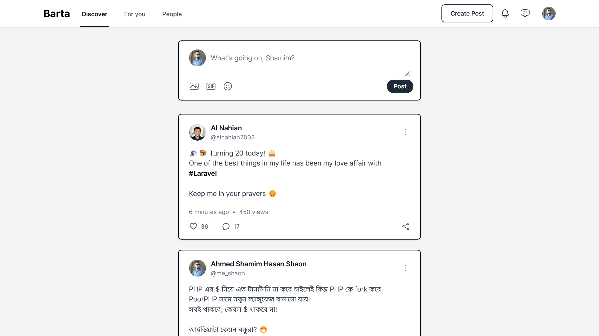

# Barta: Connect, Share, and Inspire

Barta is a minimalist social platform designed to bring people together through meaningful conversations and shared experiences. Whether you're looking to connect with friends, discover new communities, or express yourself creatively, Barta provides a space where everyone can engage, inspire, and be heard

## Features for `assignment-1` branch

-   User registration
-   User login
-   User profile view
-   User profile update

## Installation

First, clone this repository:

```bash
git clone https://github.com/tetat/barta/tree/assignment-1
```

Switch to the repository folder:

```bash
cd barta
```

Install all dependencies using Composer:

```bash
composer install
```

Copy the `.env.example` file and make the required configuration changes in the `.env` file:

```bash
cp .env.example .env
```

Generate a new application key:

```bash
php artisan key:generate
```

Run the database migrations (set the database connection in `.env` before migrating):

```bash
php artisan migrate
```

Start the local development server:

```bash
php artisan serve
```
